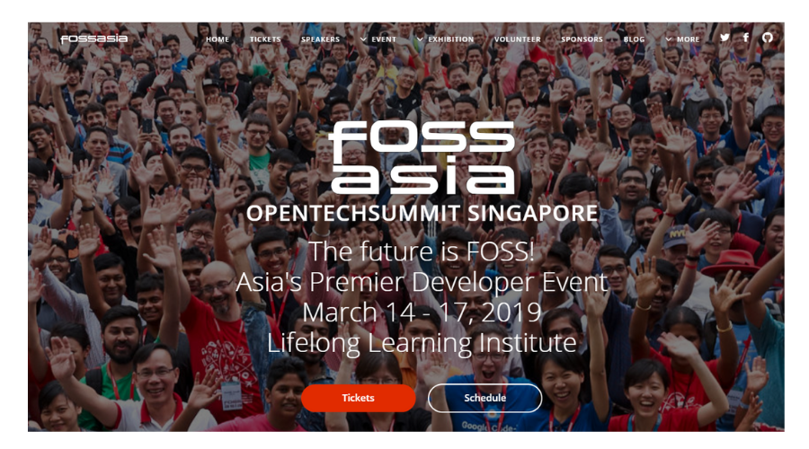

 
 
## FOSSASIA OPENTECHSUMMIT SINGAPORE 2019
#### The future is FOSS! Asia's Premier Developer Event March 14 - 17, 2019 Lifelong Learning Institute
- [**Ticket**](https://eventyay.com/e/3689bc98/)
- [**Schedule**](https://2019.fossasia.org/event/schedule.html) 

### Topics and Tracks
**i) Personal Voice Assistants and Artificial Intelligence**  
Learn about natural language processing, how to build skills and actions for voice assistants or how to create your own Open Source chatbots in the [Artificial Intelligence](https://2019.fossasia.org/event/tracks.html#Artificial%20Intelligence) deep technology track. Join sessions covering Bot Framework, Tensorflow, Dataprep and more.
 
**ii) Cloud, Container, DevOps**  
Get better insights in how to deploy apps on the cloud more efficiently and save your company money. Sessions in the [Cloud, Containers, DevOps](https://2019.fossasia.org/event/tracks.html#Cloud,%20Containers,%20DevOps) track cover Kubernetes, Serverless Architecture, Microservices, Docker Kompose, Omnibus, OpenStack, Virtual Kubelet, and Continuous Integration.
 
**iii) Blockchain**  
Meet developers and startups working on the blockchain to create solutions for distributed computing, cloud services and Fintech in the [Blockchain](https://2019.fossasia.org/event/tracks.html#Blockchain) track.  

**iv) Cybersecurity**  
Find out how to keep your services secure in the [Cybersecurity](https://2019.fossasia.org/event/tracks.html#Cybersecurity) track. The track has sessions about Encryption with PGP, SELinux, Secrets Management, Backups, QubesOS, Securing Web and Javascript apps. 
**v) Web & Mobile**  
What technologies will we need for the Conversational Web? How will existing technologies change and what else is happening in tech for web and mobile platforms? A wide variety of topics are covered in the [Web Technologies](https://2019.fossasia.org/event/tracks.html#Web%20Technologies) and [Mobile Technologies](https://2019.fossasia.org/event/tracks.html#Mobile%20Technologies) track with talks and workshops about JS frameworks, PWA, Android, Web VR and AR. 

**vi) Hardware, Design and Production**  
The FOSSASIA Open Tech Summit covers topics from software to hardware and knowledge. These are the ingredients for production. We have a dedicated track on [Hardware & Design](https://2019.fossasia.org/event/tracks.html#Hardware%20&%20Design). Apart from technical topics speakers will share their experience from making prototype to going to large scale production and working with mass manufacturers.  

**vii) Open Data, Internet Society, Community**  
More and more governments, companies and citizens share data for the benefit of the society. What are the use cases for Open data? What possibilities do we have for a truly free society in the times of tracking devices and supervision technologies, how to keep communities engaged in Free and Open Source development? These are some of the questions in the [Open Data, Internet, and Community](https://2019.fossasia.org/event/tracks.html#Open%20Data,%20Internet,%20Community) track. 

**viii) Database**  
Meet developers of PostgreSQL, MySQL, Apache Spark, MariaDB and NoSQL projects and learn how to save your company money with Open Source database solutions in the [Database](https://2019.fossasia.org/event/tracks.html#Database) track. Specific topics include Scaling TB of data, Real-time data masking, Replication Features, Performance Schema, BigQuery, and Immutable Key-Value Stores.  

**ix) Kernel & Platform**  
The [Kernel & Platform](https://2019.fossasia.org/event/tracks.html#Kernel%20&%20Platform) track covers topics from the Linux Kernel to BSD and desktop systems such as Meilix or applications like VLC. Learn about BSD network servers, Hacking with x86 Windows Tablets, Asynchronous integration of GPU computing with HPX many task processing, Unikernelized Linux, Open Build Service in Debian, and Learn C from the trenches.  
**x) Science Tech and Education**  
Science needs to be open and verifiable. As more and more tools are available to a larger part of the population the chance to become a scientist or simply to participate in citizen science increases. What tools exist? What hardware is available? How to do science hands-on with Open Source software and hardware? The [Science Tech and Education](https://2019.fossasia.org/event/tracks.html#Science%20&%20Education) track covers it. 

**xi) Open Science and Open Data Hackathon with UNESCO**
In the [FOSSASIA Hackathon](https://fossasia-hackathon.devpost.com/) developers, designers, tech contributors, bloggers, and journalists join in to develop Open Data apps and games for sustainable development and indigenous languages using FOSSASIA technologies.

